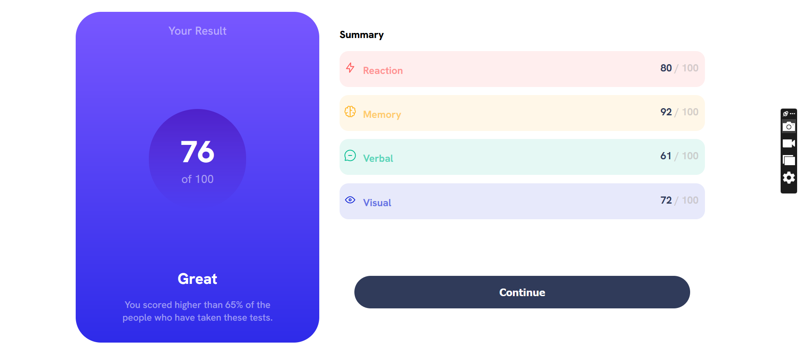
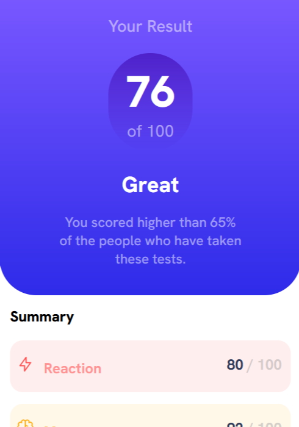
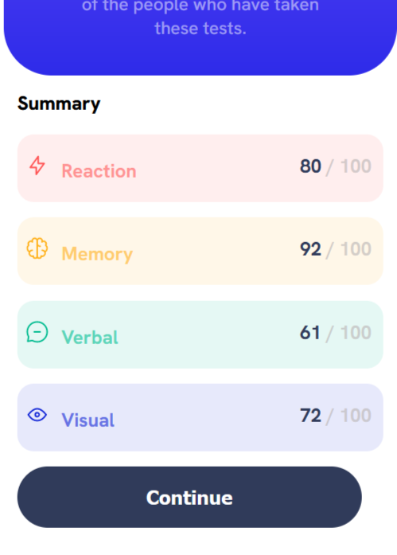

# Frontend Mentor - Results summary component solution

This is a solution to the [Results summary component challenge on Frontend Mentor](https://www.frontendmentor.io/challenges/results-summary-component-CE_K6s0maV). Frontend Mentor challenges help you improve your coding skills by building realistic projects.

## Table of contents

- [The challenge](#the-challenge)
- [Screenshot](#screenshot)
- [Links](#links)
- [My process](#my-process)
  - [Built with](#built-with)
- [Author](#author)

### The challenge

Users should be able to:

- View the optimal layout for the interface depending on their device's screen size
- See hover and focus states for all interactive elements on the page

### Screenshot

### Links

- Solution URL: [Add solution URL here](https://your-solution-url.com)
- Live Site URL: [Add live site URL here](https://your-live-site-url.com)

## My process

-Started with mobile first, and it was easy having the elements in place.
-Main challenge faced when handling the desktop site right from the mobile layout, but the use of media queries made it all smooth.
-It was an amazing challenge to conquer.

### Built with

- Semantic HTML5 markup
- CSS custom properties
- Flexbox
- Mobile-first workflow
- Media Queries

## Author

- Frontend Mentor - [@RaymondKalama](https://www.frontendmentor.io/profile/RaymondKalama)
- Twitter - [@kalama_ray8712](https://www.twitter.com/kalama_ray8712)
